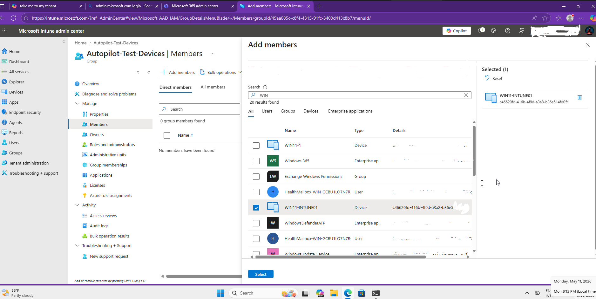
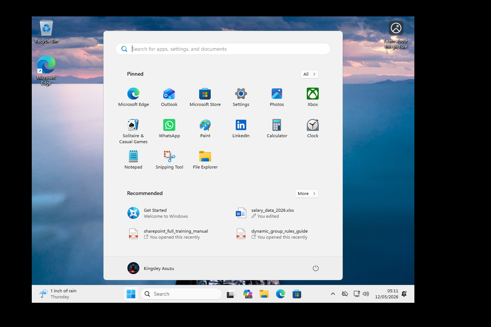

<div align="center">

# 🚀 Windows Autopilot & Microsoft Intune Deployment Lab


**I built an end-to-end Windows Autopilot deployment pipeline using Microsoft Intune and Entra ID — covering hardware hash registration, deployment profile configuration, OOBE provisioning, MFA enforcement, Windows Hello for Business enrollment, device compliance validation, and remote reset — all within a segmented VMware lab environment.**

[Overview](#-overview) • [Architecture](#-architecture) • [Environment](#-lab-environment) • [Deployment Workflow](#️-deployment-workflow) • [Skills](#-skills-demonstrated) • [Career Relevance](#-career-relevance)

</div>

---

## 📋 Lab Summary

| Field | Detail |
|---|---|
| **Certification Alignment** | SC-300 · MD-102 · AZ-104 · CompTIA Security+ |
| **Estimated Time** | 5–8 hours |
| **Estimated Cost** | $0 — Microsoft 365 Developer tenant (free) + VMware trial |
| **Difficulty** | Intermediate–Advanced |
| **Platform** | VMware · Microsoft Intune · Microsoft Entra ID |
| **Career Relevance** | Cloud Security Engineer · M365 Admin · Identity Engineer · SOC Analyst |

---

## 🎯 Overview

This lab demonstrates a complete enterprise endpoint onboarding pipeline using Windows Autopilot and Microsoft Intune — the same stack used in modern cloud-first organisations to provision thousands of devices without IT ever physically touching them.

The deployment covered the full device lifecycle:

- **Hardware hash extraction** from the Windows 11 VM using PowerShell
- **Autopilot device registration** into Microsoft Intune via CSV upload
- **Deployment profile creation** and group assignment in Intune
- **OOBE provisioning** — the device self-configured using cloud policies
- **MFA enforcement** via Microsoft Authenticator during Entra ID join
- **Windows Hello for Business** — passwordless PIN enrollment post-provisioning
- **Device compliance validation** in the Intune dashboard
- **Remote reset and recovery workflow** — simulating device lifecycle management

> Windows Autopilot and Intune are the standard enterprise MDM stack across Microsoft-heavy environments. Hands-on experience deploying and managing this pipeline is directly applicable to cloud security, endpoint management, and M365 administration roles.

---

## 🏗 Architecture

### Autopilot Deployment Flow

```
┌─────────────────────────────────────────────────────────────────────────┐
│                     MICROSOFT CLOUD SERVICES                            │
│                                                                         │
│  ┌──────────────────────┐          ┌──────────────────────────────────┐ │
│  │   Microsoft Entra ID │          │       Microsoft Intune           │ │
│  │                      │          │                                  │ │
│  │  • Device Identity   │◄────────►│  • Autopilot Device Registry    │ │
│  │  • MFA Enforcement   │          │  • Deployment Profile           │ │
│  │  • Conditional Access│          │  • Compliance Policy            │ │
│  │  • Entra Join        │          │  • Device Inventory             │ │
│  └──────────┬───────────┘          └──────────────┬───────────────────┘ │
│             │                                     │                     │
└─────────────┼─────────────────────────────────────┼─────────────────────┘
              │  Entra Join + MFA                   │  Profile Push
              ▼                                     ▼
┌─────────────────────────────────────────────────────────────────────────┐
│                    VMWARE LAB ENVIRONMENT                               │
│                                                                         │
│  ┌──────────────────────────────────────────────────────────────────┐  │
│  │                   Windows 11 Pro VM                              │  │
│  │                                                                  │  │
│  │  1. Validate Windows 11 version — confirm prerequisites met     │  │
│  │  2. PowerShell → Extract Hardware Hash → Export CSV             │  │
│  │  3. Upload CSV to Intune → Device Registered in Autopilot      │  │
│  │  4. Create Deployment Profile → Assign to Group → Add Device   │  │
│  │  5. OOBE → Org Sign-In → MFA Approval → Entra Join            │  │
│  │  6. Autopilot Profile Applied → Policies Deployed               │  │
│  │  7. Windows Hello PIN Setup → Provisioning Complete             │  │
│  │  8. Intune Inventory → Compliance Validated ✅                  │  │
│  └──────────────────────────────────────────────────────────────────┘  │
│                                                                         │
│  Network Segments:  vmnet3 · 192.168.10.0/24  (Internal/Management)   │
│                     vmnet2 · 192.168.20.0/24  (Isolated Testing)       │
│                     vmnet5 · 10.10.10.0/24    (Segmented Host-Only)    │
└─────────────────────────────────────────────────────────────────────────┘
```

---

## 🖥 Lab Environment

| Component | Detail |
|---|---|
| **Virtualisation** | VMware Workstation Pro |
| **Endpoint VM** | Windows 11 Pro — Autopilot target device |
| **Identity Platform** | Microsoft Entra ID — device identity and authentication |
| **MDM Platform** | Microsoft Intune — endpoint management and compliance |
| **MFA** | Microsoft Authenticator — push notification approval during Entra join |
| **Passwordless Auth** | Windows Hello for Business — PIN-based post-provisioning |
| **Firewall / Router** | pfSense — network segmentation between lab zones |
| **Automation** | PowerShell — hardware hash extraction via `Get-WindowsAutopilotInfo` |

### Network Segmentation

| Network | Subnet | Purpose |
|---|---|---|
| **Internal / Management** | 192.168.10.0/24 (vmnet3) | Windows endpoint and management traffic |
| **Isolated Testing** | 192.168.20.0/24 (vmnet2) | Kali security testing — segmented from management |
| **Host-Only Lab** | 10.10.10.0/24 (vmnet5) | Dedicated segmented lab network |

---

## 🛠️ Deployment Workflow

### Step 1 — VMware Network Segmentation Configured

Three isolated host-only networks were configured in VMware Virtual Network Editor before deploying any VMs, establishing the segmented lab boundary that prevents test traffic from crossing into management zones.


---

### Step 2 — Windows 11 Version Validated

Windows 11 version and build details were confirmed as the first action on the endpoint — before any enrollment or script execution. Autopilot requires a minimum Windows 10/11 build, so this prerequisite check prevents registration failures down the line.


---

### Step 3 — Windows Device Sign-In to Entra ID

With the OS version confirmed, the Windows 11 VM was connected to the Microsoft Entra ID tenant using an organisational account. This is the beginning of the cloud identity join — the device authenticates against Entra before Intune can manage it.


---

### Step 4 — MFA Authentication Approved via Microsoft Authenticator

Microsoft Authenticator was used to approve the push notification during Entra ID sign-in. MFA is enforced as a conditional access requirement — no device joins the tenant without a second factor.


---

### Step 5 — Device Successfully Joined to Entra ID

The Windows 11 VM confirmed successful join to the Microsoft Entra ID tenant. From this point the device has a cloud identity and is visible in the Entra admin centre.


---

### Step 6 — Get-WindowsAutopilotInfo Script Installed

The `Get-WindowsAutopilotInfo` PowerShell module was installed from the PowerShell Gallery. This is the Microsoft-provided tool for extracting the hardware hash needed to register a device in Autopilot.

```powershell
# Run as Administrator in PowerShell
Install-Script -Name Get-WindowsAutopilotInfo -Force
```


---

### Step 7 — Hardware Hash Generated and Exported to CSV

The hardware hash was extracted from the Windows 11 VM and exported to a CSV file. The hash uniquely identifies the device to the Autopilot service — it is what links the physical (or virtual) machine to the Intune deployment profile.

```powershell
# Export hardware hash to CSV
Get-WindowsAutopilotInfo -OutputFile C:\AutopilotHWID.csv
```


---

### Step 8 — Hardware Hash CSV Uploaded to Intune

The exported CSV file was imported into Microsoft Intune via the Windows Autopilot devices blade. This registers the device in the Autopilot service and links it to the tenant.


---

### Step 9 — CSV Validated Successfully in Intune

Intune validated the uploaded hardware hash CSV with no errors. The device record was accepted into the Autopilot device inventory.


---

### Step 10 — Device Registered in Autopilot Inventory

The Windows 11 VM appeared in the Windows Autopilot devices list inside Intune, confirming the hardware hash was processed and the device is now Autopilot-registered.


---

### Step 11 — Autopilot Deployment Profile Created

With the device registered, an Autopilot deployment profile was created in Intune and configured for enterprise self-deploying mode. The profile is created before the device is added to any group — it defines the deployment settings that will be applied during OOBE.


---

### Step 12 — Device Added to Deployment Group

The registered device was added to the Autopilot target deployment group. The group is the bridge between the device and the deployment profile — a device must be in the group for the profile to apply during OOBE.



---

### Step 13 — Profile Assigned to Deployment Group

The deployment profile was assigned to the target group. From this point, any device in the group that enters OOBE will receive this profile automatically — no manual configuration required.


---

### Step 14 — Device Confirmed in Group Membership

The enrolled endpoint was confirmed as a member of the assigned deployment group. Group membership was verified before initiating OOBE to ensure the profile assignment was active and would be picked up during provisioning.


---

### Step 15 — OOBE Deployment Experience Initiated

The Windows 11 VM was reset to trigger the Out-of-Box Experience. Autopilot intercepted the OOBE and applied the deployment profile — replacing the standard consumer setup screens with the enterprise provisioning flow.


---

### Step 16 — Organisational Sign-In During OOBE

The user authenticated with organisational credentials at the Autopilot OOBE prompt. This step joins the device to Entra ID and triggers Intune enrollment simultaneously — the device never needs to be manually configured.


---

### Step 17 — Network Connectivity Validated During Provisioning

Network connectivity across the segmented VMware lab was confirmed during the Autopilot provisioning workflow. Cloud policy delivery requires outbound connectivity to Microsoft endpoints — the pfSense routing configuration was validated here.


---

### Step 18 — Device Provisioned via Autopilot Policies

Windows Autopilot automatically applied the assigned cloud policies to the endpoint during provisioning. No manual configuration was required — the profile drove the entire setup sequence from OOBE through to a compliant desktop.


---

### Step 19 — Windows Hello for Business Enrollment Initiated

Following successful provisioning, Windows Hello for Business enrollment was triggered. This is the passwordless authentication method enforced by the Intune policy — replacing the password with a device-bound PIN or biometric.


---

### Step 20 — Windows Hello PIN Configured

A secure PIN was configured as the Windows Hello credential. The PIN is device-bound and backed by the TPM — it cannot be used on another device, making it fundamentally more secure than a reusable password.


---

### Step 21 — Windows Hello Enrollment Complete

Windows Hello for Business enrollment completed successfully. The device is now configured for passwordless authentication backed by Entra ID and enforced through the Intune compliance policy.


---

### Step 22 — Autopilot Deployment Complete

The Windows 11 endpoint completed the full Autopilot provisioning sequence and loaded into the configured enterprise desktop environment — fully managed, cloud-joined, and compliant from first boot.



---

### Step 23 — Device Visible in Intune Inventory

The provisioned endpoint appeared in the Microsoft Intune managed device inventory. The Intune admin centre shows device health, OS version, last check-in, and compliance status — giving administrators full visibility without physical access.


---

### Step 24 — Device Compliance Validated

The endpoint passed all configured Intune compliance checks. Compliance validation confirms the device meets the security baseline — if it fails, Conditional Access policies would block access to corporate resources.


---

### Step 25 — Remote Reset and Recovery Workflow

Remote wipe and reset operations were demonstrated to simulate the device lifecycle management workflow an IT admin uses when offboarding a user or recovering a compromised device — all initiated from Intune without physical access.

**Recovery reset initiated:**


**Reset configuration selected:**


**Reset confirmed:**


---

## 🧠 Skills Demonstrated

| Skill | Real-World Application |
|---|---|
| **Windows Autopilot deployment** | Zero-touch provisioning used by enterprise IT to onboard thousands of devices without manual setup |
| **Microsoft Intune administration** | The standard MDM platform in Microsoft-heavy enterprises — managing policies, compliance, and app deployment |
| **Microsoft Entra ID integration** | Cloud identity join is the foundation of modern endpoint management — replaces traditional AD domain join |
| **Hardware hash extraction (PowerShell)** | The technical mechanism for registering any device into Autopilot — required for all deployment scenarios |
| **MFA enforcement via Conditional Access** | Enforcing MFA at device join time is a Zero Trust requirement — prevents unmanaged devices from entering the tenant |
| **Windows Hello for Business** | Passwordless authentication reduces credential theft risk — enforced via Intune policy |
| **Device compliance validation** | Compliance gates access to corporate resources via Conditional Access — core to any Zero Trust architecture |
| **Remote reset and wipe** | Device lifecycle management — offboarding, lost device response, and re-deployment workflows |
| **VMware network segmentation** | Demonstrates understanding of network isolation principles applied in enterprise lab design |

---

## 🎯 Career Relevance

| Role | How This Lab Applies |
|---|---|
| **Cloud Security Engineer** | Intune + Entra ID + Conditional Access is the Microsoft Zero Trust endpoint stack |
| **Microsoft 365 Administrator** | Autopilot and Intune administration are core MD-102 exam domains |
| **Identity Engineer** | Entra ID join, MFA enforcement, and Windows Hello configuration map directly to IAM engineering work |
| **SOC Analyst** | Device compliance status and Intune inventory are used during endpoint investigation workflows |
| **IT Systems Administrator** | Autopilot + Intune is replacing traditional imaging workflows across enterprise environments |

---

## 🔐 Security Controls Implemented

| Control | Implementation | Outcome |
|---|---|---|
| **MFA on device join** | Microsoft Authenticator push required during Entra ID enrollment | No device joins tenant without second factor |
| **Passwordless authentication** | Windows Hello for Business PIN enforced post-provisioning | Credential theft surface reduced |
| **Device compliance gating** | Intune compliance policy validated against security baseline | Non-compliant devices blocked from corporate resources |
| **Cloud-based management** | All configuration delivered via Intune — no local admin access required | Consistent, auditable endpoint configuration |
| **Network segmentation** | pfSense enforces boundaries between lab network zones | Test traffic isolated from management network |
| **Remote wipe capability** | Intune remote reset demonstrated | Lost or compromised devices can be wiped without physical access |

---

## 📁 Repository Structure

```
windows-autopilot-intune/
│
├── README.md
└── screenshots/
    ├── vmware-network-segmentation.png
    ├── windows11-version-validation.png
    ├── entra-id-device-signin.png
    ├── mfa-authenticator-approval.png
    ├── entra-id-device-join-success.png
    ├── install-get-windowsautopilotinfo-script.png
    ├── generate-autopilot-hardware-hash.png
    ├── upload-autopilot-hardware-hash-csv.png
    ├── autopilot-csv-validation-success.png
    ├── autopilot-device-registration-success.png
    ├── autopilot-profile-creation.png
    ├── autopilot-device-added-to-group.png
    ├── autopilot-profile-group-assignment.png
    ├── autopilot-device-group-membership.png
    ├── autopilot-oobe-configuration.png
    ├── autopilot-organization-signin.png
    ├── autopilot-network-connection.png
    ├── autopilot-device-provisioning.png
    ├── windows-hello-enrollment.png
    ├── windows-hello-pin-setup.png
    ├── windows-hello-complete.png
    ├── windows-autopilot-deployment-complete.png
    ├── intune-device-inventory.png
    ├── intune-device-compliance-validation.png
    ├── windows-recovery-reset.png
    ├── windows-reset-configuration.png
    └── windows-reset-confirmation.png
```

---

## 🔗 Related Labs

| Lab | Description |
|---|---|
| **[Azure SOC Homelab — Splunk SIEM](https://github.com/kingsrule50/azure-soc-homelab)** | Splunk SIEM on Azure — ingesting AD logs, SPL detection rules, dashboards, and automated alerting |
| **[Wireshark Threat Detection Lab](https://github.com/kingsrule50/wireshark-threat-detection-lab)** | Packet-level SYN scan and SMB enumeration detection in a segmented VMware environment |

---

## 📚 References

- [Windows Autopilot Documentation — Microsoft](https://learn.microsoft.com/en-us/autopilot/)
- [Microsoft Intune Documentation](https://learn.microsoft.com/en-us/mem/intune/)
- [Microsoft Entra ID — Device Management](https://learn.microsoft.com/en-us/entra/identity/devices/)
- [Get-WindowsAutopilotInfo Script](https://www.powershellgallery.com/packages/Get-WindowsAutopilotInfo)
- [Windows Hello for Business Overview](https://learn.microsoft.com/en-us/windows/security/identity-protection/hello-for-business/)
- [MD-102 Endpoint Administrator Certification](https://learn.microsoft.com/en-us/credentials/certifications/modern-desktop/)

---

<div align="center">

**Chinedu Kingsley Asuzu**
Cloud Security Engineer · Microsoft 365 · Identity & Endpoint Management

*Part of a hands-on cloud security lab series · Microsoft 365 Developer Tenant · $0 cost*

</div>
